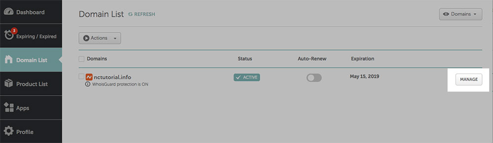
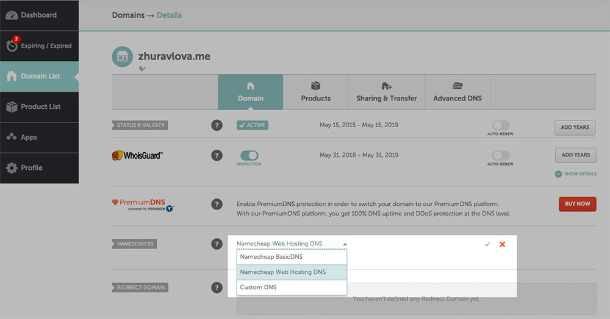

<h1 class="capitalize">COMD2451</h1>
<h2 class="sentence center">Setting up your web site with Namecheap hosting</h2>

---

<section class="section">
    <h2 class="sentence">Connecting your Namecheap domain to your Namecheap hosting</h2>

Once you have ***created*** your ***account*** on [namecheap.com](https://www.namecheap.com/), have ***purchased*** a `domain` and `hosting package` with them, you are ***ready*** to [connect](https://www.namecheap.com/hosting/how-to-set-up-hosting-account/) your `domain` to your `Namecheap` ***hosting***.

***First***, ***log in*** to your `account` (if you are ***not*** already ***logged in***), and ***click*** on the `Domains` ***tab***.

***Next***, select `Manage` ***next*** to the `domain name` you would ***like*** to ***navigate*** to your ***site***.

    

***Next***, ***scroll*** to the `Nameservers` ***section*** and ***select*** `Namecheap Web Hosting DNS` from the `drop-down` ***menu***. Please ***ensure*** that you ***save*** any ***changes*** you have ***made*** by ***selecting*** the `tick` ***icon***.

    

</section>

---

<section class="section">
    <h2 class="sentence">Once the nameservers on Namecheap are set ...</h2>

***According*** to [Namecheap](https://www.namecheap.com/hosting/how-to-set-up-hosting-account/),

> Once the nameservers are set, it can take up to 24 - 48 hours for everything to update. Don't worry, though — you can start building your website before this process is complete.

</section>

---

<section class="section"> 
    <h2 class="sentence">Choose a tool to build your web site</h2>

To ***help*** you ***easily*** manage all the ***great*** services your `Shared Hosting` account ***offers***, we have a ***handy*** feature in place called `cPanel` (control panel). It ***allows*** you to ***build*** and ***manage*** your `web site` as well as ***manage*** `web mail`, `SSL` ***certificates*** and ***more***. You can ***easily*** log in to `cPanel` ***directly*** from your `Namecheap Account Panel`.

To ***do so***, ***select*** `Domain List` with `"All Products"` ***view***, ***hover over*** the `Hosting` ***icon***, ***select*** `"Manage"` from the `drop-down` ***menu***, and ***click*** `"Go to cPanel"`.

    

It ***may*** take up to `30 minutes` for your ***new*** hosting account to be ***activated***. ***Therefore***, ***don’t*** worry if you ***see*** `"Alert"` near your `hosting plan` ***icon*** in your `Namecheap` account. It ***should*** be ***activated*** soon.

***Once*** you have ***logged in*** to your `cPanel`, feel ***free*** to ***explore*** the ***various*** tools that are ***included*** in your `Shared Hosting` ***plan***.

</section>

---

<section class="section">
    <h2 class="sentence">Ensuring the safety of your web site: enabling SSL</h2>

[SSL](https://www.websecurity.digicert.com/security-topics/what-is-ssl-tls-https) (aka secure sockets layer) is the ***standardized*** form of ***encryption*** for `web sites`. `SSL` certificates ***keep*** your data ***secure*** between ***servers***, even ***helping*** your `Google SEO` ***ranking***.

</section>

---

<section class="section">
    <h2 class="sentence"> Choosing your password wisely</h2>

To ***protect*** your `cPanel` ***account*** and its ***data***, it’s ***very*** important to ***choose*** a ***strong*** `password`.

</section>

---

<section class="section">
    <h2 class="sentence">Consider Two-Factor Authorization (2FA)</h2>

You can ***enhance*** the ***overall*** security of your `data` and ***prevent*** any ***potential*** `hacking` by ***enabling*** `Two-Factor Authorization`.

</section>

---

<section class="section">
    <h2 class="sentence">Related Resources</h2>

+ [How to Set Up, Use, and Build Your Website: Your Quick Start Guide to Shared Hosting on Namecheap](https://www.namecheap.com/hosting/how-to-set-up-hosting-account/)

</section>